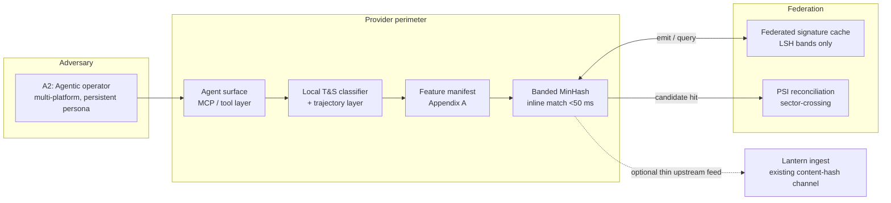

# Decentralized Telemetry for Adversarial AI Intent

A cross-provider handshake protocol for exchanging structural signatures of adversarial AI intent, without moving raw prompts, user identifiers, or model weights.

**Working Draft v8.1 · May 2026**
Fahrawn Gill · Advisor, AI Governance & Cross-Platform Safety, Alliance to Counter Crime Online (ACCO)

[](paper/Decentralized_Telemetry_Adversarial_AI_Intent_v8.1.pdf)
[](#privacy-invariant)
[](LICENSE)

---

## What this is

This repository hosts the specification of a decentralized handshake protocol for cross-provider exchange of *structural* signatures of adversarial intent in agentic AI deployments. The protocol is designed to sit as runtime middleware inside existing Trust & Safety stacks, alongside — not in place of — content-hash infrastructure such as the Tech Coalition's Lantern program.

It combines:

- **Locality-sensitive hashing** (banded MinHash) over a canonical feature manifest, for sub-50 ms inline matching inside the provider perimeter.
- **Private set intersection** for sector-crossing reconciliation across participants.

Online child exploitation is used as the lead worked example because it is the current highest-severity instance and the regulatory clock under EU AI Act Article 5 is shortest. The same primitives extend, with no architectural changes, to indirect prompt injection in agentic systems and to multi-turn jailbreaks across the broader agentic ecosystem.

This is a specification document, not a deployed system. Status of each load-bearing claim is given in the [Maturity Matrix](#maturity-matrix).

## How to read this

| If you are… | Start with |
|---|---|
| A Trust & Safety architect | Sec. 4 (Prompt-Level Intervention Layer), Sec. 7 (Signature Primitive Design), Sec. 11 (Deployment Topology) |
| An adversarial-ML researcher | Sec. 5 (Adversarial Taxonomy), Sec. 6 (Behavioral Architecture), Sec. 12 (Validation Framework) |
| A governance / policy reader | Sec. 2 (Threat Model), Sec. 10 (Compliance Posture), Sec. 14 (Research Agenda) |
| Reviewing claim status | Table 1 (Maturity Matrix), reproduced [below](#maturity-matrix) |

The paper is in [`paper/Decentralized_Telemetry_Adversarial_AI_Intent_v8.1.pdf`](paper/Decentralized_Telemetry_Adversarial_AI_Intent_v8.1.pdf).

## Position in the stack



The protocol's signal-exchange surface is the **federated signature cache** plus the **PSI reconciliation channel**. Lantern's existing content-hash ingest is unchanged; the protocol provides a thin upstream feed where a participant chooses to expose one.

## Why this layer is missing

Most existing AI-safety infrastructure operates either at the *model layer* (training data, fine-tuning, RLHF) or at the *output layer* (content filtering, hash-matching against known CSAM corpora, post-hoc signal sharing). Both miss the intermediate layer at which adversarial intent is *expressed* and at which agentic exploitation is now being initiated.

The structural claim of the paper is that adversarial prompts have detectable *form* that survives lexical evasion, and that agentic automation amplifies that form rather than obscuring it. Cross-provider visibility on this form is the specific gap this protocol fills. See Sec. 4 for the full argument, Sec. 5 for the six-class adversarial taxonomy that operationalizes it.

## Maturity Matrix

Every load-bearing claim in the paper carries one of four status tags. The matrix in Table 1 of the paper is reproduced in summary here so reviewers can calibrate the document at a glance.

| Tag | Meaning |
|---|---|
| **specified** | Normative design choice fixed by the protocol. A participant must accept these to be running this protocol. |
| **proposed** | Architectural recommendation supported by cited production precedent. Configurable. |
| **hypothesized** | Expected behavior awaiting empirical confirmation in pilot. Operating targets. |
| **demonstrated** | Validated either by cited prior production work or by the synthetic-validation framework in Sec. 7.4. |

The taxonomy is intentionally conservative. Detection-lift and trust-decay calibration carry `hypothesized` tags until pilot data exists, regardless of the closed-form math underneath them.

## Threat model (summary)

| ID | Class | Capability | Goal |
|---|---|---|---|
| A1 | Individual offender | Black-box query access | Elicit policy-violating output via prompt-level framing |
| **A2** | **Agentic automation network** *(lead class, per 2025–2026 reporting)* | Coordinated fine-tuned agents, persistent persona, cross-platform memory | Orchestrate exploitation lifecycle at scale |
| A3 | Compromised participant platform | Full signature emission rights | Free-ride on network reputation or provide regulatory cover |
| A4 | External de-anonymizing observer | Read access to emitted signatures + candidate-prompt generation | Recover originating prompt or user identity |
| A5 | Regulatory misuser | Legal compulsion of a participant | Scope creep beyond enumerated harms |

Security goals SG1–SG5 (detection lift, signature unlinkability, Byzantine tolerance, data minimization, scope confinement) are stated normatively in Sec. 2.3.

## Privacy invariant

> No raw prompt text, no user identifier, and no model weight transits the federation at any time.

Only derived artifacts — LSH bands and PSI commitments — leave a participant's perimeter. The signature space is gated by a minimum-entropy condition `H(f) ≥ H_min` (recommended `H_min = 24` bits) so that dictionary attack against the emitted signature is infeasible within per-signature TTL at protocol rate limits. Construction and rationale are in Sec. 7.1 and Appendix A.

## Compliance posture

Designed for deployment under:

- **EU AI Act** — Article 5(1)(a)(b) prohibitions on manipulative systems; enforcement powers apply from 2 August 2026.
- **GDPR** — Articles 5 and 22 (data minimization, automated-decision safeguards).
- **GPAI Code of Practice** — Safety & Security Chapter, Measure 5.1 (agentic capabilities).
- **UK Online Safety Act**, **US TAKE IT DOWN Act** (May 2025), advancing **ENFORCE Act**.

The protocol rides above Lantern's existing governance foundation and requires no changes to current Lantern signal types. Mapping is `proposed` per Table 1 and is not a substitute for participant-level conformity assessment.

## Scope and non-goals

In scope:
- Hosted-model adversarial prompts (A1).
- Multi-platform agentic automation (A2, lead class).
- Indirect prompt injection on agentic systems where the agent surface participates in the federation.

Out of scope (Sec. 2.5):
- Fully air-gapped open-source deployments.
- Replacing training-time alignment techniques. The protocol is a runtime cross-provider layer and is explicitly orthogonal to Constitutional AI, Open Character Training, and inoculation prompting (Sec. 4).
- Model-weight-level interventions.

## Repository contents

```
.
├── paper/
│   └── Decentralized_Telemetry_Adversarial_AI_Intent_v8.1.pdf
├── CITATION.cff
├── LICENSE
└── README.md
```

The repository currently hosts the specification document and citation metadata. A reference implementation of the signature-primitive and synthetic-validation harness (Sec. 7.4) is the next deliverable; it will be released under the same license when the operating-point parameters have been re-checked against an additional benchmark and the manifest schema has stabilized at v8.x.

## Research agenda

The specification is ready for pilot deployment. It does not close the questions a production rollout will raise. The paper's Sec. 14 enumerates the open work; the items most immediately relevant to a pilot:

- High-fidelity adversarial benchmark generation (extending PAN 2012 / Perverted Justice with synthesized A2 trajectories under access control).
- Cross-lingual trajectory normalization beyond English and Korean.
- PSI deployment for sector-crossing handshakes (AI providers ↔ financial institutions, on the model of Block / Western Union Lantern participation).
- Formal capability attestation integrated into the manifest layer.
- HRIA-style governance assessment on the BSR template.

Pilot collaborators and reviewers are welcome — see *Contact* below.

## Citation

```bibtex
@techreport{gill2026decentralized,
  title  = {Decentralized Telemetry for Adversarial {AI} Intent:
            A Cross-Provider Handshake Protocol for the Agentic Era,
            with Online Child Exploitation as the Lead Worked Example},
  author = {Gill, Fahrawn},
  year   = {2026},
  month  = {May},
  number = {Working Draft v8.1},
  note   = {Independent research; advisory engagement with the
            Alliance to Counter Crime Online (ACCO).
            Forwarded by ACCO leadership to U.S. tech-policy
            and state-legislative channels.}
}
```

## License

Released under [Creative Commons Attribution 4.0](LICENSE). You may share and adapt with attribution. Nothing in this repository constitutes legal advice or a substitute for participant-level conformity assessment under the regulatory instruments cited in Sec. 10.

## Contact

Fahrawn Gill · gillfahrawn@gmail.com · [linkedin.com/in/fahrawn-gill-1a9ba4163](https://linkedin.com/in/fahrawn-gill-1a9ba4163)

Substantive technical critique, pilot interest, and pointers to prior art are all welcome. Issues and pull requests against the specification text are the preferred channel for review comments.
