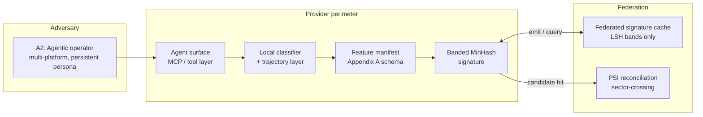
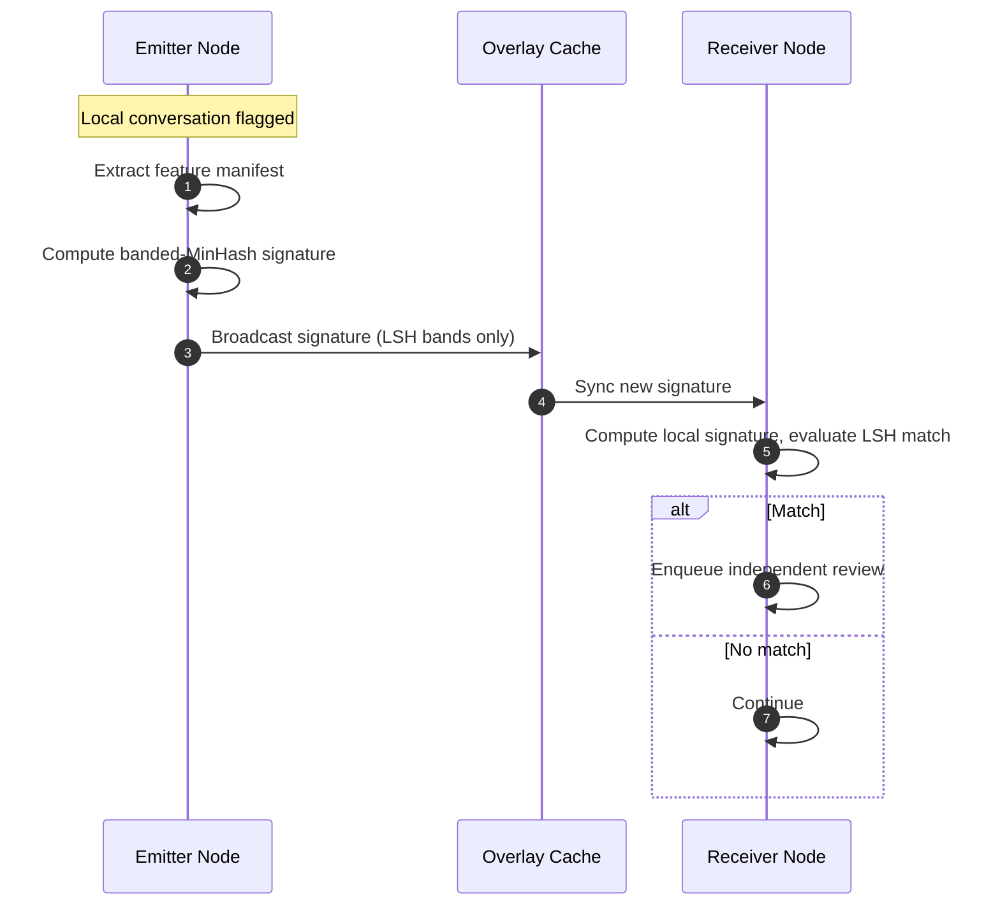

# Adversarial Intent Telemetry

**An empirical study of behavioral-signature detection under adaptive perturbation.**

Fahrawn Gill · Advisor, AI Governance & Cross-Platform Safety, Alliance to Counter Crime Online (ACCO)

[](https://www.gnu.org/licenses/agpl-3.0)
[](#data-provenance-and-tiers)
[](#what-the-evidence-shows)

---

## What this is

This repository asks a narrow, falsifiable question: **does a cross-provider behavioral-signature detection scheme survive contact with real adversarial data and adaptive perturbation?**

The scheme under test is a banded-MinHash signature primitive plus a trajectory-level sequence model, originally specified as a deployable cross-provider protocol in the design paper included here (`Decentralized_Telemetry_Adversarial_AI_Intent_v8.1.pdf`). **That paper is the design under test, not a validated system.** This README reports what happened when the primitives were run against real data.

The short version: a per-message classifier detects grooming structure in the static PAN 2012 corpus with high AUC, but the protocol's signature-matching primitive achieves near-zero recall on real conversations at any false-positive rate a deployment could tolerate, and detection degrades sharply — in the heaviest perturbation, below random for the per-message baseline — once realistic adaptive noise is introduced. The trajectory model is more robust to that perturbation than the per-message baseline, which is the one direction worth pursuing further.

This is reported as a mixed result on purpose. The contribution is the decomposition of *where* behavioral detection holds and where it breaks, on real data, with the failure modes documented rather than smoothed over.

## How to read this

| If you are… | Start with |
|---|---|
| A reviewer with five minutes | [What the evidence shows](#what-the-evidence-shows) — the results table |
| An adversarial-ML researcher | [Robustness under perturbation](#robustness-under-perturbation), then `experiments/exp_trajectory_lift.py` and `tools/inject_discourse_noise.py` |
| A T&S / detection engineer | [The architecture under evaluation](#the-architecture-under-evaluation), then `experiments/exp_m3_frontier.py` |
| Checking how claims are bounded | [Integrity infrastructure](#integrity-infrastructure) — the truth ledger and validity-boundary statement |
| Reading the original design | `Decentralized_Telemetry_Adversarial_AI_Intent_v8.1.pdf` (design under test) |

## What the evidence shows

All numbers below are produced by scripts in `experiments/` and written to `experiments/results/`. Each row carries an honest status; nothing here is asserted beyond what the corresponding result file supports.

| Question | Result | Status |
|---|---|---|
| Can a per-message classifier detect grooming in real static data (PAN 2012)? | LinearSVC, **AUC 0.986**, recall **0.93** at FPR 0.05 | **Holds** (real, author-disjoint split) |
| Does the protocol's MinHash signature-match primitive recall real conversations at a deployable operating point? | At the recommended (b=16, r=16): **recall 0.018, FPR 0.0013**. Usable recall (0.92) only appears at FPR **0.99** | **Does not hold** — no good operating point on real text |
| Does the trajectory/sequence model beat the per-message baseline on clean data? | F1 lift **-0.023**, 95% CI [-0.042, -0.002] | **Negative / inconclusive** on clean data |
| Does detection survive realistic perturbation? | Discourse-noise: AUC **0.92 -> 0.79**. NCMEC-constrained realism set: per-message AUC collapses to **0.13** (below random); sequence model holds at **0.57** | **Breaks** for per-message; trajectory model degrades more gracefully |
| Does reputation-weighted aggregation tolerate Byzantine participants (simulation)? | Empirical beta* = **0.5** > 1/3 threshold; SPRT isolates **2.27x** faster than Hoeffding; stealth adversary beta* = 0.4 | **Demonstrated in simulation only** |
| Does a payoff-perturbation mechanism raise cooperation in 2x2 games (GT-HarmBench)? | Cooperation improvement **0.184**; Prisoner's-Dilemma defection 1.0 -> 0.57 | **Analytical** result (mechanism design, not LLM behavior) |

The two findings a skeptical reader should take away:

1. **The cross-provider signature primitive — the core of the original protocol — does not separate real conversations.** Real inter-conversation Jaccard similarity sits well below the band-match inflection (J* ~ 0.84 at the recommended point), so recall is near zero unless the false-positive rate is pushed to where the detector is useless. This is a clean negative result against the protocol's headline mechanism.

2. **Trajectory structure costs a little on clean data but buys robustness under adaptive perturbation.** On clean PAN 2012 the per-message baseline (AUC 0.986) edges out the sequence model (0.977). Under the heaviest realism perturbation the ordering inverts: the per-message signal falls below random (0.13) while the sequence model retains weak but real discrimination (0.57). The order-shuffle evasion test points the same way — destroying message order to evade the sequence model also destroys the grooming structure an adversary is trying to execute (`exp_trajectory_lift.py`, evasion simulation).

## Robustness under perturbation

The perturbation work is the part of this study most worth extending. `tools/inject_discourse_noise.py` applies retrieval-swap and reciprocity-asymmetry perturbations; the NCMEC-constrained set in `data/agentic_ncmec/pan_ncmec_trajectories.jsonl` adds a parallel telemetry layer sampled from 2025 reporting priors **with zero edits to the underlying PAN-derived text** (text Jaccard = 1.0 between input and output is enforced, so any lift cannot come from rewritten dialogue).

The below-random AUC (0.13) on the per-message baseline is reported as-is and flagged: an AUC under 0.5 means the perturbation systematically inverts the per-message signal on this set, which is itself informative about how brittle lexical/per-message features are, but the magnitude should be read as a small-sample, single-perturbation observation rather than a calibrated robustness curve. See `experiments/results/detection_ncmec.json`, `discourse_noise_report.json`, and `realism_delta_metrics.json`.

## The architecture under evaluation

The diagrams below describe the **design being tested**, not a deployed system. They are retained from the design paper because they make the evaluation legible: the signature primitive and the federated cache are exactly the components whose real-data behavior is measured above.



The **per-message classifier** (the `CLS` node) is what works on clean data. The **banded-MinHash signature** (the `LSH` node) is the primitive that fails to separate real conversations. The federation and PSI layers are design proposals that were never reached empirically and are not claimed as validated.



## Data provenance and tiers

Every experiment labels its data source. The tiers are never mixed in one result row.

- **Tier 1 — PAN 2012 real annotated** (`data_source: pan2012_real_annotated`): behavioral structure from real predator conversations (PAN 2012 Sexual Predator Identification), created independently of this work. All headline detection claims rest here. Raw PAN 2012 is **not redistributed** (see `data/pan12/README.md`); obtain it from the original source.
- **Tier 2 — perturbation-constrained agentic** (`data_source: pan2012_phase_adapted_ncmec_2025`): the Tier 1 structure with a non-invasive telemetry layer sampled from 2025 NCMEC reporting distributions used **only as sampling priors, never as content**. Surface text is unedited (text Jaccard = 1.0).
- **Tier 0 — pure LLM synthetic** (`data_source: pure_synthetic_llm`): ablation baseline only, used to demonstrate circularity risk. Never cited as primary validation. A `discrimination_report.json` shows generated trajectories are still structurally distinguishable from real ones (AUC 0.87), which is the reason Tier 0 is not load-bearing.

> **A note on the synthetic S-curve.** `validation/synthetic/s_curve.py` produces an illustrative S-curve on *synthetic* Beta-distributed Jaccard pairs. It demonstrates the shape of the band-match function, not detection performance on real data. The real operating-point numbers are in `experiments/results/m3_frontier.json`; read those, not the synthetic harness, for what the primitive actually does.

## Reproduce

```bash
git clone https://github.com/gillfahrawn/adversarial-intent-telemetry.git
cd adversarial-intent-telemetry
pip install -r tools/requirements.txt -r validation/synthetic/requirements.txt
```

Experiments that run without restricted data (synthetic and simulation):

```bash
python validation/synthetic/s_curve.py        # illustrative S-curve (synthetic)
python experiments/exp_m8_byzantine.py        # Byzantine tolerance sweep (simulation)
python experiments/exp_m8_sprt.py             # SPRT vs Hoeffding isolation (simulation)
python experiments/exp_f3_reciprocity.py      # payoff-perturbation mechanism (GT-HarmBench)
```

Experiments that require the PAN 2012 corpus placed under `data/pan12/` (not redistributed):

```bash
python experiments/exp_m3_author_split.py     # author-disjoint split
python experiments/exp_m3_frontier.py         # operating-point frontier on real data
python experiments/exp_trajectory_lift.py     # per-message vs sequence model + evasion test
python experiments/exp_annotate_pan_manifest.py
```

Outputs land in `experiments/results/`. A cross-domain caveat: `tools/manifest_gen.py` patterns target AI-jailbreak language (role injection, hypothetical framing), so on 2012 human-human grooming the manifest fields populate sparsely (e.g. `intent_class` 0.044, `behavior_phase` 0.054). That low transfer is reported in `pan_manifest_annotation_report.json` and bounds the cross-domain claim — it is a finding, not a bug to paper over.

## Integrity infrastructure

This repository is built to be cloned and checked. Two files exist specifically to keep claims honest:

- `experiments/results/truth_ledger.json` — labels every dataset `EMPIRICAL`, `REPRESENTATION`, or `SYNTHETIC`, with the validation regime used.
- `experiments/results/validity_boundary_statement.txt` — states which claims are multi-trial validated and **explicitly removes** narrative claims (e.g. intrinsic behavioral "phase transitions") that the continuous-metric data does not support.

Splits are author-disjoint where it matters (`exp_m3_author_split.py`), lifts carry bootstrap CIs, and ablations isolate causality (the no-events ablation exists so perturbation lift can't be attributed to text differences). Where a result is negative or inconclusive, it is labeled that way.

## What this is not

- Not a validated or deployable detection protocol. The signature primitive's real-data recall is near zero at deployable FPR.
- Not a prevalence claim about 2026 agentic abuse. NCMEC 2025 figures are used as sampling priors for perturbation, not as evidence of an established attack distribution.
- Not a benchmark for LLM behavior in the F3 result, which is an analytical mechanism-design experiment on game matrices.
- Not a substitute for the design paper's full argument; the paper is included as the design under test.

## Citation

```bibtex
@techreport{gill2026adversarial,
  title  = {Adversarial Intent Telemetry: An Empirical Study of
            Behavioral-Signature Detection Under Adaptive Perturbation},
  author = {Gill, Fahrawn},
  year   = {2026},
  note   = {Independent research; design paper "Decentralized Telemetry
            for Adversarial AI Intent" (v8.1) included as the design under
            test. Advisory engagement with the Alliance to Counter Crime
            Online (ACCO).}
}
```

## License

Released under the [GNU Affero General Public License v3.0](https://www.gnu.org/licenses/agpl-3.0). Nothing here is legal advice or a substitute for participant-level conformity assessment.

## Contact

Fahrawn Gill · gillfahrawn@gmail.com · [linkedin.com/in/fahrawn-gill-1a9ba4163](https://linkedin.com/in/fahrawn-gill-1a9ba4163)

Substantive technical critique, replication attempts, and pointers to prior art are welcome via issues or pull requests.
