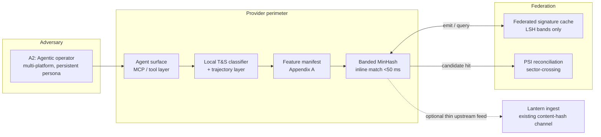
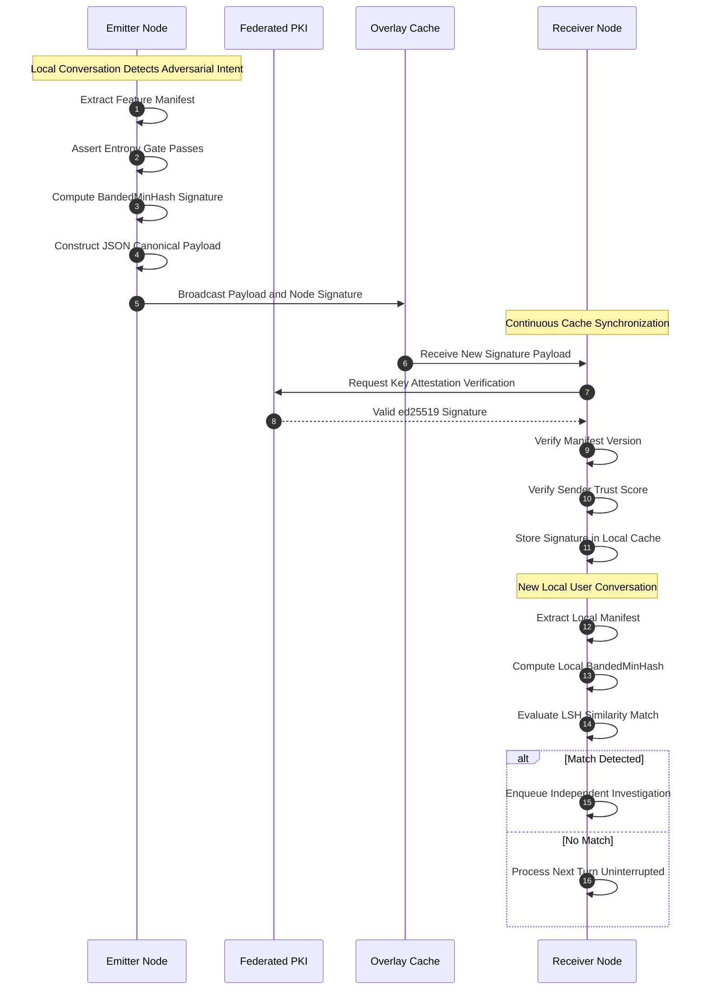
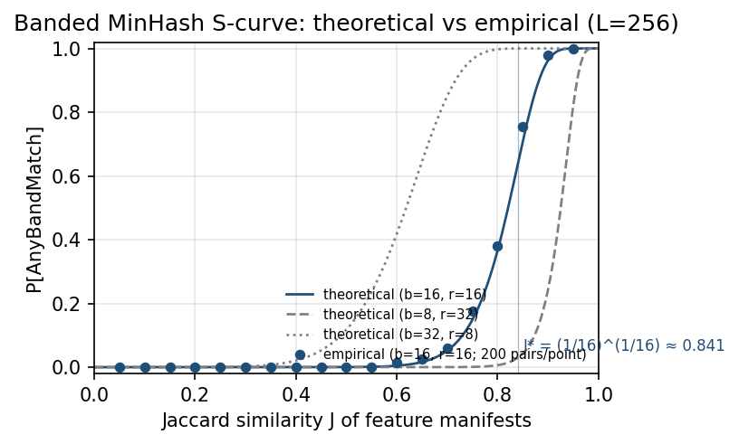

# Decentralized Telemetry for Adversarial AI Intent

A decentralized handshake protocol for cross-provider exchange of structural signatures of adversarial AI intent, without moving raw prompts, user identifiers, or model weights.

**Working Draft v8.1 · May 2026**  
Fahrawn Gill · Advisor, AI Governance & Cross-Platform Safety, Alliance to Counter Crime Online (ACCO)

[](Decentralized_Telemetry_Adversarial_AI_Intent_v8.1.pdf)
[](#privacy-invariant)
[](https://creativecommons.org/licenses/by/4.0/)

---

## What this is

This repository hosts the specification of a decentralized handshake protocol for cross-provider exchange of *structural* signatures of adversarial intent in agentic AI deployments. The protocol is designed to sit as runtime middleware inside existing Trust & Safety stacks, alongside — not in place of — content-hash infrastructure such as the Tech Coalition's Lantern program.

Each participating provider extracts a canonical **feature manifest** from behavioral signals at the prompt layer. The manifest is passed through a minimum-entropy gate, then projected into a banded MinHash signature. Only these locality-sensitive hash bands transit the federation — no raw prompt text, no user identifiers, no model weights leave the provider perimeter. A receiver queries the shared band cache for inline matching in under 50 ms, then escalates candidate hits to **Private Set Intersection** for cross-sector reconciliation. The protocol adds a thin upstream feed to Lantern's existing content-hash ingest where a participant chooses to expose one.

Online child exploitation is the lead worked example: it is the current highest-severity instance of agentic adversarial automation, and the regulatory clock under EU AI Act Article 5 is shortest. The same primitives extend, with no architectural changes, to indirect prompt injection in agentic systems and to multi-turn manipulation across the broader agentic ecosystem.

This is a specification document, not a deployed system. Status of each load-bearing claim is given in the [Maturity Matrix](#maturity-matrix) and carries a tag — `specified`, `proposed`, `hypothesized`, or `demonstrated` — throughout. The paper is at [`Decentralized_Telemetry_Adversarial_AI_Intent_v8.1.pdf`](Decentralized_Telemetry_Adversarial_AI_Intent_v8.1.pdf).

## How to read this

| If you are… | Start with |
|---|---|
| A Trust & Safety architect | *Sec. 4* (Prompt-Level Intervention Layer), *Sec. 7* (Signature Primitive Design), *Sec. 11* (Deployment Topology) |
| An adversarial-ML researcher | *Sec. 5* (Adversarial Taxonomy), *Sec. 6* (Behavioral Architecture), *Sec. 7.4* (Synthetic Validation) |
| A governance / policy reader | *Sec. 2* (Threat Model), *Sec. 10* (Compliance Posture), *Sec. 14* (Research Agenda) |
| Reviewing claim status | *Table 1* (Maturity Matrix), reproduced [below](#maturity-matrix) |

## Position in the stack



The signal-exchange surface is the **federated signature cache** and the **PSI reconciliation channel**. Lantern's existing content-hash ingest is unchanged; the protocol provides a thin upstream feed where a participant chooses to expose one.

The sequence below shows how the three-party handshake proceeds within a single transaction.



## Why this layer is missing

Most existing AI-safety infrastructure operates either at the *model layer* (training data, fine-tuning, RLHF) or at the *output layer* (content filtering, hash-matching against known corpora, post-hoc signal sharing). Both miss the intermediate layer at which adversarial intent is expressed and at which agentic exploitation is initiated.

The structural argument (*Sec. 4*) is that adversarial prompts have detectable *form* that survives lexical evasion, and that agentic automation amplifies that form rather than obscuring it. A coordinated agentic network — operating across providers with persistent persona and cross-platform memory — produces feature manifests that cluster in a distinguishable region of Jaccard space. Cross-provider visibility on this structure is the specific gap this protocol fills.

The scale of the gap is documented. Tech Coalition Lantern processes 2 million-plus signals per year with 350,000 enforcement actions, and AI-facilitated harm has grown at 17× (*Sec. 1*, [5]). Cross-provider adaptive attack success exceeded 85% in the 2026 systematic review on which the paper draws (*Abstract*, [1]). Anthropic MCP deployments have accumulated multiple public CVEs in the same period. Per-provider classifiers cannot observe coordination across provider boundaries; content-hash channels require the harmful material to exist before a hash can be registered. The protocol acts before extraction, on the behavioral trajectory that precedes it. See *Sec. 4* for the full argument and *Sec. 5* for the adversarial taxonomy that operationalizes it.

## Maturity Matrix

Every load-bearing claim in the paper carries one of four status tags. The matrix in *Table 1* is reproduced in summary here so reviewers can calibrate the document at a glance.

| Tag | Meaning |
|---|---|
| `specified` | Normative design choice fixed by the protocol. A participant must accept these to be running this protocol. |
| `proposed` | Architectural recommendation supported by cited production precedent. Configurable. |
| `hypothesized` | Expected behavior awaiting empirical confirmation in pilot. Operating targets, not guarantees. |
| `demonstrated` | Validated either by cited prior production work or by the synthetic-validation framework in *Sec. 7.4*. |

The taxonomy is intentionally conservative. Detection-lift and trust-decay calibration carry `hypothesized` tags until pilot data exists, regardless of the closed-form math underlying them.

## Threat model

The threat model (*Sec. 2*) identifies five adversary classes, stated normatively.

| ID | Class | Capability | Goal |
|---|---|---|---|
| A1 | Individual offender | Black-box query access | Elicit policy-violating output via prompt-level framing |
| **A2** | **Agentic automation network** *(lead class, per 2025–2026 reporting)* | Coordinated fine-tuned agents, persistent persona, cross-platform memory | Orchestrate exploitation lifecycle at scale |
| A3 | Compromised participant platform | Full signature emission rights | Free-ride on network reputation or provide regulatory cover |
| A4 | External de-anonymizing observer | Read access to emitted signatures + candidate-prompt generation | Recover originating prompt or user identity |
| A5 | Regulatory misuser | Legal compulsion of a participant | Scope creep beyond enumerated harms |

Security goals SG1–SG5 (detection lift, signature unlinkability, Byzantine tolerance, data minimization, scope confinement) are stated normatively in *Sec. 2.3*.

*Sec. 5*, *Table 2* operationalizes the adversarial taxonomy as six structural classes, each paired with its primary behavioral signal at the prompt layer.

| Class token | Label | Behavioral signal |
|---|---|---|
| `reframe` | Semantic reframing | Intent preserved; pragmatic envelope shifted (declarative → interrogative, direct → hypothetical, first-person → third-person fictional) |
| `euphem` | Lexical substitution | Flagged tokens replaced with semantically dense unflagged variants, in-group argot, or transliteration |
| `decomp` | Compositional decomposition | Intent partitioned across turns, each individually benign; forbidden output reachable only by composing across turns |
| `role_inj` | Authority / role injection | Prompt asserts a role (researcher, parent, law enforcement) or invokes a system-level instruction frame to shift policy posture |
| `hypoth` | Hypothetical sandboxing | Request framed as fiction, simulation, training-data generation, red-team exercise, or worldbuilding |
| `ctx_poison` | Cumulative context poisoning | Earlier turns establish unverified premises (consent, age, jurisdiction) that later turns rely on without restating |

These tokens populate the `intent_class` field of the feature manifest (*Appendix A*); the sequence classifier tracks their progression across turns to produce the `behavior_phase` and `phase_transition` fields — detection lift at the trajectory layer is `hypothesized` (*Sec. 12*) and the architectural rationale is `proposed`.

## Signature primitive

The protocol gates every manifest emission on a minimum-entropy condition (*Sec. 7.1*, *Appendix A*). The match probability is defined only over manifests satisfying:

$$H(f) \geq H_{\min} = 24 \text{ bits}$$

This prevents dictionary attacks against emitted signatures within the per-signature TTL at protocol rate limits. The gate requirement is `specified`; the value $H_{\min} = 24$ bits is `proposed`.

The match probability for banded MinHash over a manifest pair with Jaccard similarity $J$ is (*Sec. 7.1*, Eq. (1)):

$$P_{\text{match}}(J;\, b, r) = 1 - (1 - J^r)^b$$

This S-curve shapes recall vs. precision across the Jaccard distribution. The result is `demonstrated` against synthetic manifest pairs in *Sec. 7.4* / Figure 1.

The inflection point — where the S-curve is steepest and the protocol most sharply discriminates — is:

$$J^* = \left(\frac{1}{b}\right)^{1/r}$$

At the recommended (b=16, r=16) operating point, $J^* = (1/16)^{1/16} \approx 0.841$. Adversarial manifests cluster above this value; benign analogues cluster below it. This operating-point selection is `demonstrated`.

The FPR constraint bounds the false-positive rate at a target tolerance $\alpha_0$ (*Sec. 7.1*, Eq. (2)):

$$1 - \left(1 - J_{\text{benign,max}}^r\right)^b \leq \alpha_0$$

At (b=16, r=16), empirical FPR against synthetic benign-analogue pairs is 0.0002. This is `demonstrated`.

The three operating points evaluated in the synthetic validation (*Table 3*, *Sec. 7.4*), each at L=256 total bands:

| Configuration | L | $J^*$ | Recall | FPR |
|---|---|---|---|---|
| b=8, r=32 | 256 | 0.937 | 0.0048 | 0.0000 |
| **b=16, r=16** | 256 | **0.841** | **0.0854** | **0.0002** |
| b=32, r=8 | 256 | 0.648 | 0.5148 | 0.0252 |

Numbers are from the synthetic validation harness (`validation/synthetic/s_curve.py`): 5,000 adversarial-similar pairs (Jaccard ~ Beta(8,5), mean ≈ 0.618) and 5,000 benign-analogue pairs (Jaccard ~ Beta(3,8), mean ≈ 0.271). Recall at (b=16, r=16) is 0.0854 because the inflection at $J^* \approx 0.841$ sits above most of the adversarial distribution — the mean adversarial Jaccard of 0.618 is well below the inflection, so the operating point concentrates recall on the upper tail rather than on the bulk. This is the intended behavior: only the tightest adversarial clusters clear the band-match threshold, holding FPR at 0.0002. The full empirical S-curve is shown below.



## Byzantine isolation

The protocol must tolerate up to a fraction $\beta^*$ of malicious participants without corruption of the aggregate signal. Peer-trust weights are updated by exponential moving average after each observation (*Sec. 9*, Eq. (4)):

$$w_{ij}(t+1) = (1 - \lambda)\, w_{ij}(t) + \lambda\, \hat{p}_{ij}(t)$$

At $\lambda = 0.1$, the EMA has an effective memory of two to three weeks. The smoothing parameter is `hypothesized`; pilot calibration will tighten it. The mathematical structure of the update rule is `specified`.

When accumulated observations $n$ are sufficient, the isolation threshold is derived from the Hoeffding inequality (*Sec. 9*, Eq. (5)–(6)):

$$\varepsilon^*(n;\, \delta) = \sqrt{\frac{\ln(1/\delta)}{2n}}$$

At $n = 500$ observations and $\delta = 10^{-3}$, the threshold resolves to $\varepsilon^* \approx 0.083$, maintaining Byzantine tolerance up to $\beta^* \geq 1/3$. The parameters $n$ and $\delta$ are `hypothesized`; the Hoeffding bound itself is `specified`. Pilot calibration will tighten both.

## Privacy invariant

> **No raw prompt text, no user identifier, and no model weight transits the federation at any time.**

Only derived artifacts — LSH bands and PSI commitments — leave a participant's perimeter. The entropy gate ($H(f) \geq H_{\min}$) ensures that the emitted signature cannot be inverted to recover the originating prompt within the per-signature TTL at protocol rate limits. Construction and rationale are in *Sec. 7.1* and *Appendix A*. This invariant is `specified`.

## Compliance posture

Designed for deployment under:

- **EU AI Act** — Article 5(1)(a)(b) prohibitions on manipulative systems; enforcement powers apply from 2 August 2026.
- **GDPR** — Articles 5 and 22 (data minimization, automated-decision safeguards); the protocol's privacy invariant (no raw prompts, no user identifiers, no model weights in transit) satisfies the data-minimisation requirement at the architectural level.
- **GPAI Code of Practice** — Safety & Security Chapter, Measure 5.1 (agentic capabilities).
- **UK Online Safety Act**, **US TAKE IT DOWN Act** (May 2025), advancing **ENFORCE Act**.

The protocol rides above Lantern's existing governance foundation and requires no changes to current Lantern signal types. Compliance mapping is `proposed` per *Table 1* and is not a substitute for participant-level conformity assessment (*Sec. 10*). The entropy gate ($H(f) \geq H_{\min}$) and the `scope_class` field provide the technical basis for demonstrating scope confinement under SG5 to a regulatory auditor; the gate requirement is `specified` and the audit mapping is `proposed`.

## Scope and non-goals

In scope:

- Hosted-model adversarial prompts (A1).
- Multi-platform agentic automation (A2, lead class).
- Indirect prompt injection where the agent surface participates in the federation.

Out of scope (*Sec. 2.5*):

- Fully air-gapped open-source deployments.
- Replacing training-time alignment techniques. The protocol is a runtime cross-provider layer, explicitly orthogonal to Constitutional AI, Open Character Training, and inoculation prompting (*Sec. 4*).
- Model-weight-level interventions.

## Repository contents

```
.
├── Decentralized_Telemetry_Adversarial_AI_Intent_v8.1.pdf
├── spec/
│   └── manifest-schema.json          normative feature manifest schema (Appendix A)
├── examples/
│   └── trajectory.json               synthetic A2-class 7-turn adversarial trajectory
├── tools/
│   ├── manifest_gen.py               rule-based manifest extractor CLI
│   └── requirements.txt
└── validation/
    └── synthetic/
        ├── s_curve.py                operating-point harness (Sec. 7.4)
        ├── requirements.txt
        └── results/
            ├── results.json          numeric output (recall, FPR, S-curve data)
            └── s_curve.png           empirical vs. theoretical S-curve plot
```

The normative manifest schema is in `spec/manifest-schema.json`. It is independently citable and usable without running any code. `tools/manifest_gen.py` demonstrates that the schema is implementable: it reads a trajectory JSON and emits a conforming manifest, validating output against the schema before writing.

## Quick Start

**Step 1 — Reproduce Figure 1 and the operating-point numbers from *Sec. 7.4*.**

```bash
git clone https://github.com/gillfahrawn/adversarial-intent-telemetry.git
cd adversarial-intent-telemetry
pip install -r validation/synthetic/requirements.txt
python validation/synthetic/s_curve.py
# Outputs: validation/synthetic/results/s_curve.png
#          validation/synthetic/results/results.json
```

Runtime is under 60 seconds on a single core. No network calls; no API keys.

**Step 2 — Generate a feature manifest from the synthetic A2-class trajectory.**

```bash
pip install -r tools/requirements.txt
python tools/manifest_gen.py --input examples/trajectory.json --output out/manifest.json
# Prints:  H(f) = 112.35 bits  (gate: H_min = 24.0 bits)  →  PASS
# Outputs: out/manifest.json
```

The extractor is rule-based pattern matching; it prints the aggregate manifest entropy and exits non-zero if the entropy gate fails. `out/manifest.json` is a conforming instance of `spec/manifest-schema.json`, validated before writing. Production deployments substitute a locally calibrated classifier stack per *Sec. 7.1*.

## Research agenda

The specification is ready for pilot review. The paper's *Sec. 14* enumerates the open work; items most relevant to a first pilot:

- High-fidelity adversarial benchmark generation (extending PAN 2012 / Perverted Justice with synthesized A2 trajectories under access control).
- Cross-lingual trajectory normalization beyond English and Korean.
- PSI deployment for sector-crossing handshakes (AI providers ↔ financial institutions, on the model of Block / Western Union Lantern participation).
- Formal capability attestation integrated into the manifest layer.
- HRIA-style governance assessment on the BSR template.

Pilot collaborators and reviewers are welcome — see *Contact* below.

## Citation

```bibtex
@techreport{gill2026decentralized,
  title  = {Decentralized Telemetry for Adversarial {AI} Intent:
            A Cross-Provider Handshake Protocol for the Agentic Era,
            with Online Child Exploitation as the Lead Worked Example},
  author = {Gill, Fahrawn},
  year   = {2026},
  month  = {May},
  number = {Working Draft v8.1},
  note   = {Independent research; advisory engagement with the
            Alliance to Counter Crime Online (ACCO).
            Forwarded by ACCO leadership to U.S. tech-policy
            and state-legislative channels.}
}
```

## License

Released under [Creative Commons Attribution 4.0](https://creativecommons.org/licenses/by/4.0/). You may share and adapt with attribution. Nothing in this repository constitutes legal advice or a substitute for participant-level conformity assessment under the regulatory instruments cited in *Sec. 10*.

## Contact

Fahrawn Gill · gillfahrawn@gmail.com · [linkedin.com/in/fahrawn-gill-1a9ba4163](https://linkedin.com/in/fahrawn-gill-1a9ba4163)

The paper has been forwarded by ACCO leadership through U.S. tech-policy and state-legislative channels; pilot interest from prospective federated participants is the current priority. Substantive technical critique, pilot interest, and pointers to prior art are welcome. Issues and pull requests against the specification text are the preferred channel for review comments.
